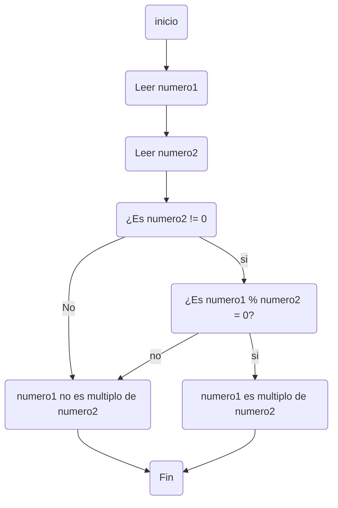

# Taller-1
## Los LegoCoders


### Integrantes
Jeyson Fernando Romero    - Bryan Felipe Jaime    - Juan Manuel Coronell
 <br>

## Resultados del quiz
##### 1. Jeyson Fernando Romero Fajardo

   <br>

   

##### 2. Juan Manuel Corornell

   

##### 3. Bryan Felipe Jaime
    
   
   <br>


## 2.Realice un programa que lea tres números reales y determine cuál es el mayor.

<br>

```py
# Leer tres números reales 
numero1 = float(input("Ingrese el primer número real: "))
numero2 = float(input("Ingrese el segundo número real: "))
numero3 = float(input("Ingrese el tercer número real: "))

# Determinar cuál es el mayor número
if numero1 > numero2 and numero1 > numero3:
    mayor = numero1
elif numero2 > numero1 and numero2 > numero3:
    mayor = numero2
else:
    mayor = numero3

# Mostrar el resultado
print("El mayor número es:", mayor)


```

-El programa solicita al usuario que ingrese tres números reales guardandolos en la variable.

-Luego, determina cuál de los tres números es el mayor utilizando condiciones if, elif, y else.

-Finalmente, muestra el mayor número entre los tres ingresados por el usuario utilizando el codigo print("El mayor número es:", mayor)


## 3.Realice un programa que lea un número enteros y determine si es par o impar.

<br>

```py
# Solicitar que ingrese un número entero
numero = int(input("Ingrese un número entero: "))

# Determinar si el número es par o impar
if numero % 2 == 0:
    print(numero, "es un número par.")
else:
    print(numero, "es un número impar.")

```

<br>

-El programa solicita al usuario que ingrese un número entero con La línea numero = int(input("Ingrese un número entero: "))

-Luego, determina si el número ingresado es par o impar utilizando la operación de módulo (%), Si el número dividido por 2 tiene un residuo de 0, significa que es par; de lo contrario, es impar.

-Finalmente, imprime un mensaje indicando si el número es par o impar,utilizando la instrucción print().

## 4.Realice un programa que lea dos números reales y determine si el primero es múltiplo del segundo.


<br>

```py
# Leer dos números reales 
numero1 = float(input("Ingrese el primer número real: "))
numero2 = float(input("Ingrese el segundo número real: "))

# Determinar si el primero es múltiplo del segundo
if numero2 != 0 and numero1 % numero2 == 0:
    print(numero1, "es múltiplo de", numero2)
else:
    print(numero1, "no es múltiplo de", numero2)

```

<br>

-El programa solicita al usuario que ingrese dos números reales.

-Luego, verifica si el segundo número es distinto de cero (numero2 != 0) para evitar la división por cero.

-Si el segundo número es distinto de cero y el residuo de la división del primer número entre el segundo es igual a cero (numero1 % numero2 == 0), entonces el primer número es múltiplo del segundo.

-Si se cumple la condición anterior, el programa imprime un mensaje indicando que el primer número es múltiplo del segundo. De lo contrario, imprime un mensaje indicando lo contrario.

### Diagrama de flujo



## 5.Realice un programa que lea tres números reales y determine si la suma de los dos primeros es mayor, menor o igual que el tercer número.
```py
# Problema de los 3 numeros
a=float(input("ingrese el primer sumando: "))
b=float(input("ingrese el segundo sumando: "))
c=float(input("ingrese la comparacion del total: "))

if a+b < c:
    print("la suma de "+str(a)+" con "+str(b)+" es menor que "+str(c))

elif a+b > c:
    print("la suma de "+str(a)+" con "+str(b)+" es mayor que "+str(c))

else:
    print("la suma de "+str(a)+" con "+str(b)+" es igual que "+str(c))
```
la solución a este problema fue primero definir las 3 variables numéricas reales que va a usar la computadora en su proceso de analisis. Una vez el emisor haya dado sus 3 valores para las variables se empezara el procedimiento de analisis, empezando por ver si la sumatoria de los dos primeros números es menor al tercer número, si no es así, entonces se analizara si la suma de los dos primeros números es mayor que el tercero, y si ninguna de las dos condiciones se cumple la computador devolvera la respuesta que la suma de los dos primeros es igual al tercer número. 

## 6. Escriba un programa que solicite al usuario una letra y determine si es una vocal o una consonante.
```py
# Problema de vocales y consonantes
letra=(input("ingrese una letra cualquiera: "))

if (ord(letra)) == 65:
    print("la letra "+str(letra)+" es una vocal")

elif (ord(letra)) == 69:
     print("la letra "+str(letra)+"  es una vocal")

elif (ord(letra)) == 73:
    print("la letra "+str(letra)+"  es una vocal")

elif (ord(letra)) == 79:
     print("la letra "+str(letra)+"  es una vocal")

elif (ord(letra)) == 85:
      print("la letra "+str(letra)+"  es una vocal")

elif (ord(letra)) == 97:
      print("la letra "+str(letra)+"  es una vocal")

elif (ord(letra)) == 101:
      print("la letra "+str(letra)+"  es una vocal")

elif (ord(letra)) == 105:
      print("la letra "+str(letra)+"  es una vocal")

elif (ord(letra)) == 111:
      print("la letra "+str(letra)+"  es una vocal")

elif (ord(letra)) == 117:
      print("la letra "+str(letra)+"  es una vocal")

else:
     print("la letra "+str(letra)+"  es una consonante")
```
Para este problema lo que se hizo fue hacer que existiera una variable la cual se pudiera determinar, luego se transforma esa variable con la palabra reservada ord() que nos pasa nuestra variable al código ASCII. Una vez se determina que valor tiene en el código ASCII, este se compara con todas las posibilidades que hay de vocales; incluyendo las variables de mayúsculas y minúsculas. Si en algunos de los condicionales es verdadero la computador escribira que "la letra elegida es una vocal", si no, la computadora devolvera la respuesta de "la letra elegida es una consonante".

## 7. Escriba un programa que pida 5 números reales y calcule las siguientes operaciones:
```py
# variables
a=float(input("ingrese un numero: "))
b=float(input("ingrese otro numero: "))
c=float(input("ingrese otro numero mas: "))
d=float(input("ingrese otro numero: "))
e=float(input("ingrese el ultimo numero: "))
```
lo primero que hay que hacer es definir las variables que va a usar el programa.

#### 7.1 El promedio
```py
# Calcular el promedio
print("el promedio es: "+str((a+b+c+d+e)/5))
```
Para cálcular el promedio de 5 números lo que hay que hacer es sumar los valores de todos estas variables y dividirlas entre 5. Algo bastante simple.

#### 7.2 La mediana
```py
if a<=b and a<=c and a<=d and a<=e:
    if b<=c and b<=d and b<=e:
        if c<=d and c<=e:
            print(" la mediana es "+str(c))
        elif d<=c and d<=e:
            print("la mediana es "+str(d))
        else:
            print("la mediana es "+str(e))
    elif c<=b and c<=d and c<=e:
        if b<=d and b<=e:
            print("la mediana es "+str(b))
        elif d<=b and d<=e:
            print("la mediana es "+str(d))
        else:
            print("la mediana es "+str(e))
    elif d<=b and d<=c and d<=e:
        if b<=c and b<=e:
            print("la mediana es "+str(b))
        elif c<=b and c<=e:
            print("la mediana es "+str(c))
        else:
            print("la mediana es "+str(e))
    else:
        if b<=c and b<=d:
            print("la mediana es "+str(b))
        elif c<=b and c<=d:
            print("la mediana es "+str(c))
        else:
            print("la mediana es "+str(d))

elif b<=a and b<=c and b<=d and b<=e:
    if a<=c and a<=d and a<=e:
        if c<=d and c<=e:
            print(" la mediana es "+str(c))
        elif d<=c and d<=e:
            print("la mediana es "+str(d))
        else:
            print("la mediana es "+str(e))
    elif c<=a and c<=d and c<=e:
        if a<=d and a<=e:
            print("la mediana es "+str(a))
        elif d<=a and d<=e:
            print("la mediana es "+str(d))
        else:
            print("la mediana es "+str(e))
    elif d<=a and d<=c and d<=e:
        if a<=c and a<=e:
            print("la mediana es "+str(a))
        elif c<=a and c<=e:
            print("la mediana es "+str(c))
        else:
            print("la mediana es "+str(e))
    else:
        if a<=c and a<=d:
            print("la mediana es "+str(a))
        elif c<=a and c<=d:
            print("la mediana es "+str(c))
        else:
            print("la mediana es "+str(d))

elif c<=b and c<=a and c<=d and c<=e:
    if b<=a and b<=d and b<=e:
        if a<=d and a<=e:
            print(" la mediana es "+str(a))
        elif d<=a and d<=e:
            print("la mediana es "+str(d))
        else:
            print("la mediana es "+str(e))
    elif a<=b and a<=d and a<=e:
        if b<=d and b<=e:
            print("la mediana es "+str(b))
        elif d<=b and d<=e:
            print("la mediana es "+str(d))
        else:
            print("la mediana es "+str(e))
    elif d<=b and d<=a and d<=e:
        if b<=a and b<=e:
            print("la mediana es "+str(b))
        elif a<=b and a<=e:
            print("la mediana es "+str(a))
        else:
            print("la mediana es "+str(e))
    else:
        if b<=a and b<=d:
            print("la mediana es "+str(b))
        elif a<=b and a<=d:
            print("la mediana es "+str(a))
        else:
            print("la mediana es "+str(d))

elif d<=b and d<=c and d<=a and d<=e:
    if b<=c and b<=a and b<=e:
        if c<=a and c<=e:
            print(" la mediana es "+str(c))
        elif a<=c and a<=e:
            print("la mediana es "+str(a))
        else:
            print("la mediana es "+str(e))
    elif c<=b and c<=a and c<=e:
        if b<=a and b<=e:
            print("la mediana es "+str(b))
        elif a<=b and a<=e:
            print("la mediana es "+str(a))
        else:
            print("la mediana es "+str(e))
    elif a<=b and a<=c and a<=e:
        if b<=c and b<=e:
            print("la mediana es "+str(b))
        elif c<=b and c<=e:
            print("la mediana es "+str(c))
        else:
            print("la mediana es "+str(e))
    else:
        if b<=c and b<=a:
            print("la mediana es "+str(b))
        elif c<=b and c<=a:
            print("la mediana es "+str(c))
        else:
            print("la mediana es "+str(a))

else:
    if b<=c and b<=d and b<=a:
        if c<=d and c<=a:
            print(" la mediana es "+str(c))
        elif d<=c and d<=a:
            print("la mediana es "+str(d))
        else:
            print("la mediana es "+str(a))
    elif c<=b and c<=d and c<=a:
        if b<=d and b<=a:
            print("la mediana es "+str(b))
        elif d<=b and d<=a:
            print("la mediana es "+str(d))
        else:
            print("la mediana es "+str(a))
    elif d<=b and d<=c and d<=a:
        if b<=c and b<=a:
            print("la mediana es "+str(b))
        elif c<=b and c<=a:
            print("la mediana es "+str(c))
        else:
            print("la mediana es "+str(a))
    else:
        if b<=c and b<=d:
            print("la mediana es "+str(b))
        elif c<=b and c<=d:
            print("la mediana es "+str(c))
        else:
            print("la mediana es "+str(d))
```
Este código ya es un poco mas complejo ya que toca especificar todas las combinaciones que hay de que un número sea mayor que dos de la lista, y menor que los otros dos. Saliendo así un total de 55 convinaciones entre los 5 números para determinar la mediana.

#### 7.3 El promedio multiplicativo
```py
print("el promedio multiplicativo es: "+str((a*b*c*d*e)**(0.2)))
```
Similar al código de "El promedio" este en lo único que difiere es que en vez de sumar las variables hay que multiplicarlas y ese producto hay que aplicarle la raiz de 5, ya que son un total de 5 elementos.

#### 7.4 y 7.5 Organizar de manera ascendente y descente ( estos dos son muy largos asi que estaran únicamente en el Notebook de los puntos impares)
Para ordenar de mayor a menor y de menor a mayor hay que hacer largas cadenas de condicionales que comparen las variables. Lo que hicimos fue usar comparaciones de <= para ordenar de manera ascendente y el >= para el descendente.

#### 7.6 La potencia del mayor número elevado al menor número
```py
if a>= b and a>=c and a>=d and a>=e:
    if b<=c and b<=d and b<=e and b<=a:
        print("la potencia del numero mayor elevada al menor es: "+str(a**b))
    elif c<=b and c<=d and c<=e and c<=a:
        print("la potencia del numero mayor elevada al menor es: "+str(a**c))
    elif d<=b and d<=c and d<=e and d<=a:
        print("la potencia del numero mayor elevada al menor es: "+str(a**d))
    else:
        print("la potencia del numero mayor elevada al menor es: "+str(a**e))

elif b>a and b>c and b>d and b>e:
    if a<=c and a<=d and a<=e and a<=b:
        print("la potencia del numero mayor elevada al menor es: "+str(b**a))
    elif c<=a and c<=d and c<=e and c<=b:
        print("la potencia del numero mayor elevada al menor es: "+str(b**c))
    elif d<=a and d<=c and d<=e and d<=b:
        print("la potencia del numero mayor elevada al menor es: "+str(b**d))
    else:
        print("la potencia del numero mayor elevada al menor es: "+str(b**e))

elif c>a and c>b and c>d and c>e:
    if a<=b and a<=d and a<=e and a<=c:
        print("la potencia del numero mayor elevada al menor es: "+str(c**a))
    elif b<=a and b<=d and b<=e and b<=c:
        print("la potencia del numero mayor elevada al menor es: "+str(c**b))
    elif d<=a and d<=b and d<=e and d<=c:
        print("la potencia del numero mayor elevada al menor es: "+str(c**d))
    else:
        print("la potencia del numero mayor elevada al menor es: "+str(c**e))

elif d>a and d>b and d>c and d>e:
    if a<=b and a<=c and a<=e and a<=d:
        print("la potencia del numero mayor elevada al menor es: "+str(d**a))
    elif b<=a and b<=c and b<=e and b<=d:
        print("la potencia del numero mayor elevada al menor es: "+str(d**b))
    elif c<=a and c<=b and c<=e and c<=d:
        print("la potencia del numero mayor elevada al menor es: "+str(d**c))
    else:
        print("la potencia del numero mayor elevada al menor es: "+str(d**e))

else:
    if a<=b and a<=c and a<=d and a<=e:
        print("la potencia del numero mayor elevada al menor es: "+str(e**a))
    elif b<=a and b<=c and b<=d and b<=e:
        print("la potencia del numero mayor elevada al menor es: "+str(e**b))
    elif c<=a and c<=b and c<=d and c<=e:
        print("la potencia del numero mayor elevada al menor es: "+str(e**c))
    else:
        print("la potencia del numero mayor elevada al menor es: "+str(e**d))
```
En este caso para determinar cual es la base toca hacer una comparación de >= o solamente > y para determinar el exponente hay que hacer comparaciones de <=. El resto de las especificaciones es que hay que hacer un total de 20 combinaciones, cada letra, es decir 5, tiene 4 conbinaciones posibles.

#### 7.7 La raíz cúbica del menor número
```py
if a<= b and a<=c and a<=d and a<=e:
    print("la raiz cubica del menor numero es: "+str(a**(1/3)))
elif b<a and b<c and b<d and b<e:
    print("la raiz cubica del menor numero es: "+str(b**(1/3)))
elif c<a and c<b and c<d and c<e:
    print("la raiz cubica del menor numero es: "+str(c**(1/3)))
elif d<a and d<b and d<c and d<e:
    print("la raiz cubica del menor numero es: "+str(d**(1/3)))
else:
    print("la raiz cubica del menor numero es: "+str(e**(1/3)))
```
En este problema lo que hay que hacer es poner todas las posibilidades de que una variable sea el número menor en comparacion a otros 4, y luego seguir el sencillo paso de aplicarle la raíz cúbica a este.

## 8. Escriba un programa al que se le ingrese la frecuencia de una onda en hz y como salida arroje en que parte del espectro electromagnético se encuentra.
```py
#Calcular el espectro electromagnetico en que se encuentra la onda ingresada
frecuencia= float(input("Ingrese los digitos de la frecuencia de una onda en Hz: "))
if  30*10**3 >= frecuencia:
    print("La frecuencia se encuentra en la parte del espectro electromagnetico de Muy Baja Frecuencia - Radio.")
elif 30*10**3 <= frecuencia < 650*10**3:
    print("La frecuencia se encuentra en la parte del espectro electromagnetico de Onda Larga - Radio.")
elif 650*10*3 <= frecuencia < 1.7*10**6:
    print("La frecuencia se encuentra en la parte del espectro electromagnetico de Onda Media - Radio.")
elif 1.7*10**6 <= frecuencia < 30*10**6:
    print("La frecuencia se encuentra en la parte del espectro electromagnetico Onda Corta - Radio.")
elif 30*10**6 <= frecuencia < 300*10**6:
    print("La frecuencia se encuentra en la parte del espectro electromagnetico Muy Alta Frecuencia - Radio.")
elif 300*10**6 <= frecuencia < 3*10**9:
    print("La frecuencia se encuentra en la parte del espectro electromagnetico Ultra Alta Frecuencia - Radio.")
elif 3*10**9 <= frecuencia < 300*10*9:
    print("La frecuencia se encuentra en la parte del espectro electromagnetico Microondas.")
elif 300*10**9 <= frecuencia < 6*10**12:
    print("La frecuencia se encuentra en la parte del espectro electromagnetico Infrarojo Lejano.")
elif 6*10**12 <= frecuencia < 120*10**12:
    print("La frecuencia se encuentra en la parte del espectro electromagnetico Infrarojo Medio.")
elif 120*10**12 <= frecuencia < 384*10**12:
    print("La frecuencia se encuentra en la parte del espectro electromagnetico Infrarrojo Cercano.")
elif 384*10**12 <= frecuencia < 7.89*10**14:
    print("La frecuencia se encuentra en la parte del espectro electromagnetico Visible.")
elif 7.89*10**14 <= frecuencia < 1.5*10**15:
    print("La frecuencia se encuentra en la parte del espectro electromagnetico Ultravioleta Cercano.")
elif 1.5*10**15 <= frecuencia < 30*10**15:
    print("La frecuencia se encuentra en la parte del espectro electromagnetico Ultravioleta Lejano.")
elif 30*10**15 <= frecuencia< 30*10**18:
    print("La frecuencia se encuentra en la parte del espectro electromagnetico de Rayos X.")
elif 30*10**18 <= frecuencia:
    print("La frecuencia se encuentra en la parte del espectro electromagnetico de Rayos Gamma.")
```
Comenzamos entendiendo el problema y planeando una estrategia para resolverlo, como tenemos varias variables que en este caso son las partes del espectro electromagnetico, y dependiendo de el dato que nos arroje el usuario va a imprimir una cosa o otra, entonces utilizamos if,else y elif, ya que nos permite imprimir una cosa u otra dada una condicion, en este caso un rango de valores de la frecuencia de las ondas.

## 9. Escriba un programa que reciba el nombre en minúsculas de un país de America y retorne la ciudad capital, si el país no pertenece al continente debe arrojar país no identificado.
```py
#Capitales de paises de America
pais=input("Ingrese el nombre de un pais de America: ")
pais = pais.lower()
if pais== "antigua y barbuda":
    print("La capital del pais es Saint Jhons")
elif pais=="argentina":
    print("La capital del pais es Buenos Aires")
elif pais=="bahamas":
    print("La capital del pais es Nasáu")
elif pais=="barbados":
    print("La capital del pais es Bridgetown")
elif pais=="belice":
    print("La capital del pais es Belmopán")
elif pais=="Bolivia":
    print("La capital del pais es Sucre")
elif pais=="brazil":
    print("La capitl del pais es Brasilia")
elif pais=="canadá":
    print("La capital del pais es Ottawa")
elif pais=="chile":
    print("La capital del pais es Santiago de Chile")
elif pais=="colombia":
    print("La capital del pais es Bogotá")
elif pais=="costa rica":
    print("La capital del pais es San José")
elif pais=="cuba":
    print("La capital del pais es La Habana")
elif pais=="dominica":
    print("La capital del pais es Roseau")
elif pais=="ecuador":
    print("La capital del pais es Quito")
elif pais=="el salvador":
    print("La capital del pais es San salvador")
elif pais=="estados unidos":
    print("La capital del pais es Washington D.C")
elif pais=="granada":
    print("La capital del pais es Saint George")
elif pais=="guatemala":
    print("La capital del pais es Ciudad de Guatemala ")
elif pais=="guyana":
    print("La capital del pais es Georgetown")
elif pais=="haití":
    print("La capital del pais es Puerto Príncipe")
elif pais=="honduras":
    print("La capital del pais es Tegucigalpa")
elif pais=="jamaica":
    print("La capital del pais es Kingston")
elif pais=="méxico":
    print("La capital del pais es Ciudad de México")
elif pais=="nicaragua":
    print("La capital del pais es Managua")
elif pais=="panamá":
    print("La capital del pais es Ciudad de Panamá")
elif pais=="paraguay":
    print("La capital del pais es Asunción")
elif pais=="perú":
    print("La capital del pais es Lima")
elif pais=="república dominicana":
    print("La capital del pais es Santo Domingo")
elif pais=="san cristóbal y nieves":
    print("La capital del pais es Basseterre")
elif pais=="san Vicente y las Granadinas":
    print("La capital del pais es Kingstown")
elif pais=="santa Lucía":
    print("La capital del pais es Castries")
elif pais=="surinam":
    print("La capital del pais es Paramaribo")
elif pais=="trinidad y tobago":
    print("La capital del pais es Puerto España")
elif pais=="uruguay":
    print("La capital del pais es Montevideo")
elif pais=="venezuela":
    print("La capital del pais es Caracas")
else:
    print("Pais no identificado")
```
Para la solucion de este problema utilizamos una metodologia similar a la del punto #8, ya que establecemos una condicion que debe cumplir el dato que ingrese el usuario, en este caso es una condicion restringido, ya que existe un unico dato que puede ingresar el usuario para que arroje la respuesta determinada. Además utilizamos al inicio una funcion que nos transfrome los datos que ingrese el usuario a minusculas.
## 10. Escriba un programa que dada una distancia calcule:

El tiempo que le tomaría a la luz recorrer la distancia.
El tiempo que le tomaría al sonido (en el aire) recorrer la distancia.
El tiempo que le tomaría al vehiculo comercial más veloz recorrer la distancia.
El tiempo que le tomaría a Bolt recorrer la distancia.
```py
#Dada una distancia calcular tiempo que tardaria en recorrerla distintas variables
distancia=float(input("Ingrese los digitos de una distancia en metros: "))
distancia_luz= distancia/299792458
distancia_sonido= distancia/343.2
distancia_carro= distancia/141.11
distancia_bolt= distancia/10.44
print("Tiempo que le tomaria a la luz en el vacio recorrer esa distancia es", distancia_luz, "segundos")
print("Tiempo que le tomaria a el sonido en el aire recorrer esa distancia es", distancia_sonido, "segundos")
print("Tiempo que le tomaria a el Shelby Tuatara, el carro comercial mas rapido del mundo recorrer esa distancia es", distancia_carro, "segundos")
print("Tiempo que le tomaria a Usain Bolt recorrer esa distancia es de", distancia_bolt, "segundos")
```
Este problema lo resolvemos estableciendo que el usuario pueda ingresar numeros decimales, y asi mismo el programa arroje numeros decimales, despues establecemos un variable para cada situacion estableciendo el calculo de el dato que ingrese el ususario sobre la velocidad para arrojar el tiempo. Finalmente imprimimos cada variable acompañado del texto adecuado.

